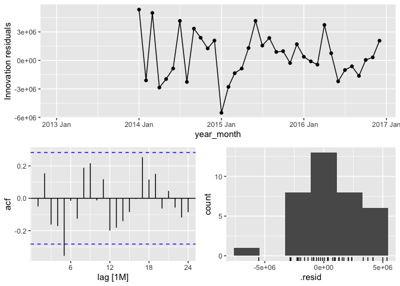
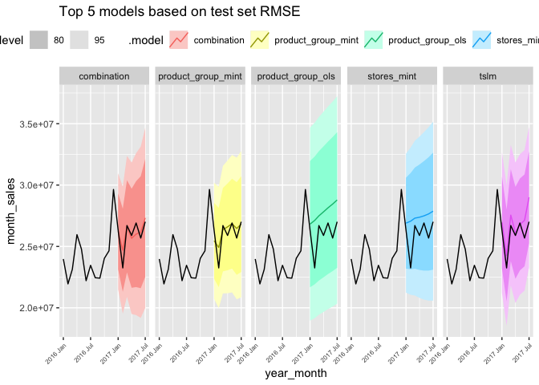

Supermarket Sales Time Series Investigation: Part 2
================

This notebook is a follow up to a part 1 analysis. [See part 1 for more
context/details](https://github.com/analyticsanalyst/sales_time_series_investigation/tree/main/part_1)

### Objective

  - apply additional forecasting techniques
  - apply product group and store aggregated forecasting
  - use test set for model assessment
  - forecast next 6 month sales using top model on test set

<!-- end list -->

``` r
library(fpp3)
library(tidyverse)
library(ggfortify)
library(gridExtra)
```

### Data Prep

``` r
### use Kaggle training dataset to represent our "business data"
sales_df <- read_csv("store-sales-time-series-forecasting/train.csv")

### Aug is a partial month so we filter to dates prior to Aug 1
sales_df <- sales_df %>%
      filter(date < '2017-08-01')

sales_ts <- sales_df %>%
   group_by(product_group = family,
            store_nbr,
            year_month = yearmonth(format_ISO8601(date, precision ="ym"))) %>%
   summarise(month_sales = sum(sales),
             sales_days = n_distinct(date)) %>%
   as_tsibble(index=year_month, key=c("product_group", "store_nbr"))

train_sales_ts <- sales_ts %>%
   filter_index("Jan 2013" ~ "Dec 2016")
   
test_sales_ts <-  sales_ts %>%
   filter_index("Jan 2017" ~ .)

train_monthly_sales <- train_sales_ts %>%
   index_by(year_month) %>%
   ungroup() %>%
   summarise(month_sales = sum(month_sales),
             sales_days = max(sales_days))

test_monthly_sales <- test_sales_ts %>%
   index_by(year_month) %>%
   ungroup() %>%
   summarise(month_sales = sum(month_sales),
             sales_days = max(sales_days))
```

### Visualize data

  - see part 1 analysis for visualizations and data exploration

### Monthly sales models

  - models fit on the monthly sales data aggregated across stores and
    product groups

<!-- end list -->

``` r
monthly_sales_models <-  train_monthly_sales %>%
   model(mean = MEAN(month_sales),
         snaive = SNAIVE(month_sales ~ lag("year")),
         tslm = TSLM(month_sales ~ trend() + season()),
         arima = ARIMA(month_sales),
         ets = ETS(month_sales),
         decomp_model = decomposition_model(
                  STL(month_sales ~ season(window = 12)),
                  ETS(season_adjust ~ season("N"))
               )
         ) %>%
   mutate(combination = (tslm + arima + decomp_model) / 3)
   
monthly_sales_models_fc <- monthly_sales_models %>%
   ### forecast 7 months to compare against test data
   forecast(h=7)
```

### Product group aggregated forecasts

  - here we create forecasts for each product group (see part 1 analysis
    for investigation of product group trends)
  - aggregate\_key() is very handy her (retains multiple levels of an
    aggregated series in tsibble object)
  - reconcile() aggregates forecasts to monthly level
  - [FP\&P3 book](https://otexts.com/fpp3/tourism.html) suggests MinT
    and OLS are often the top reconcile methods due to use of
    information across aggregation levels

<!-- end list -->

``` r
product_group_cal_month_sales <- train_sales_ts %>%
  aggregate_key(product_group, month_sales = sum(month_sales))

fit_products <- product_group_cal_month_sales %>%
   model(product_group_base = ETS(month_sales)) %>%
   reconcile(product_group_mint = min_trace(product_group_base, method = "mint_shrink"),
             product_group_ols = min_trace(product_group_base, method = "ols"))

products_fc <- fit_products %>%
   ### forecast 7 months to compare against test data
   forecast(h=7) %>%
   filter(is_aggregated(product_group)) %>%
   select(-product_group)
```

### Store group aggregated forecasts

  - similar approach to product group forecasts and then aggregating up
    to the monthly level
  - replacing product groups with stores here

<!-- end list -->

``` r
stores_cal_month_sales <- train_sales_ts %>%
  mutate(store_nbr = paste0("store_", store_nbr)) %>%
  ### drop store 52 which has zero sales in training data
  filter(store_nbr!="store_52") %>%
  aggregate_key(store_nbr, month_sales = sum(month_sales))

fit_stores <- stores_cal_month_sales %>%
   model(stores_base = ETS(month_sales)) %>%
   reconcile(stores_mint = min_trace(stores_base, method = "mint_shrink"),
             stores_ols = min_trace(stores_base, method = "ols"))

stores_fc <- fit_stores %>%
   ### forecast 7 months to compare against test data
   forecast(h=7) %>%
   filter(is_aggregated(store_nbr)) %>%
   select(-store_nbr)
```

### Compare models on test data

  - select model that minimizes RMSE on test data
  - combo (tslm, arima, decomp\_model) has the lowest RMSE
  - [forecast model combinations known to be a go to way to improve
    forecasts](https://otexts.com/fpp3/combinations.html)
  - interestingly the product group mint model is in close second
    (suggests that grouped/hierarchical models should be consider for
    future monthly sales type problems)

<!-- end list -->

``` r
all_forecasts <- bind_rows(list(monthly_sales_models_fc,
                                products_fc,
                                stores_fc))

top_5_models_rmse <- all_forecasts %>%
  accuracy(test_monthly_sales) %>%
  arrange(RMSE) %>%
  head(5) %>%
  select(.model, RMSE)
```

### Visualize top 5 models forecast on test data

  - combo model visually has the closest fit on test data

<!-- end list -->

``` r
plot_data <- bind_rows(list(train_monthly_sales, test_monthly_sales)) %>%
   filter_index("Jan 2016" ~ .)

all_forecasts %>%
   filter(.model %in% top_5_models_rmse$.model) %>%
   autoplot(plot_data) +
   facet_grid(. ~ .model) +
   theme(legend.position = "top",
         axis.text.x = element_text(angle = 45, hjust = 1, vjust = 1, size=6)) +
   labs(title="Top 5 models based on test set RMSE")
```

<!-- -->

### Fit top model on full dataset and make forecast

``` r
full_sales_data <- bind_rows(list(train_monthly_sales, test_monthly_sales))

final_model <-  full_sales_data %>%
   model(tslm = TSLM(month_sales ~ trend() + season()),
         arima = ARIMA(month_sales),
         decomp_model = decomposition_model(
                  STL(month_sales ~ season(window = 12)),
                  ETS(season_adjust ~ season("N"))
               )
         ) %>%
   mutate(final_model_combo = (tslm + arima + decomp_model) / 3)

final_model %>%
   ### forecast for next 6 months
   forecast(h=6) %>%
   filter(.model=="final_model_combo") %>%
   autoplot(full_sales_data %>% filter_index("Jan 2015" ~ .)) +
   labs(title = "Next 6 months sales forecast",
        subtitle = "Monthly sales ensemble model")
```

<!-- -->

### Sources
  - [Rob J Hyndman and George Athanasopoulos
    FP\&P3](https://otexts.com/fpp3/)
  - [Hyndman’s blog](https://robjhyndman.com/hyndsight/)
  - [Hyndman’s Github lecture
    notes](https://github.com/robjhyndman/ETC3550Slides/tree/fable) are
    useful resources as well

### TODO
- check residuals of final model
- does there still look to be signal in the data? or concerns with residuals?
- test box-cox transformation on sales
